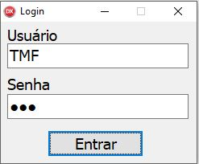

# Client-api-contas-a-pagar-delphi
## Sistema de contas a pagar Delphi consumindo api rest Java
### Sistema sendo construido para consumir 100% das regras de negócio da API Tiagomf29/Contas-a-pagar-api disponivel aqui no repositório do GitHub.  

<ul>
<li>Para que o projeto funcione com sucesso é necessário deixar rodando a API Tiagomf29/Contas-a-pagar-api conforme orientação no readme do projeto.</li>  
<li>Neste momento a única funcionalidade que está funcionando é o consumo da API validando o usuário e senha.</li> 
<li>O usuário válido conforme gravado em banco de dados é "TMF" e a senha válida conforme gravado em banco de dados é "123"</li>
</ul>

 

#### Tela de login do projeto

